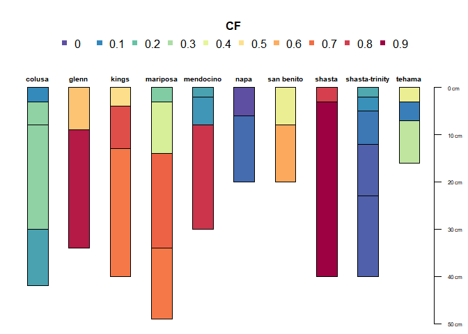

<!-- README.md is generated from README.Rmd. Please edit that file -->

[](https://github.com/ncss-tech/aqp/actions)
[](http://cran.r-project.org/web/packages/aqp)
[](https://cran.r-project.org/package=aqp)
[](http://ncss-tech.github.io/aqp/)

# Algorithms for Quantitative Pedology (aqp) package for R

## Installation

Get the stable version from CRAN:

``` r
install.packages('aqp', dep=TRUE)
```

Get the development version from Github, after installing the CRAN
version + dependencies:

``` r
remotes::install_github("ncss-tech/aqp", dependencies=FALSE, upgrade=FALSE, build=FALSE)
```

<!-- aqp hexsticker! -->

<a href="https://raw.githubusercontent.com/ncss-tech/aqp/master/misc/hexstickers/aqp_sticker_v2.png">
</a>

## Website

<http://ncss-tech.github.io/AQP/>

## Examples

``` r
library(aqp)
#> This is aqp 1.43
data(sp4)
depths(sp4) <- id ~ top + bottom

par(mar = c(0, 0, 4, 0))
plot(sp4, color = 'clay')
```


``` r
plot(sp4, color = 'CF')
```



## Citation

``` r
citation("aqp")
#> 
#> To cite aqp in publications use:
#> 
#>   Beaudette, D., Roudier, P., Brown, A. (2022). aqp: Algorithms for
#>   Quantitative Pedology. R package version 1.42.
#>   <https://CRAN.R-project.org/package=aqp>
#> 
#>   Beaudette, D.E., Roudier, P., O'Geen, A.T. Algorithms for
#>   quantitative pedology: A toolkit for soil scientists, Computers &
#>   Geosciences, Volume 52, March 2013, Pages 258-268, ISSN 0098-3004,
#>   http://dx.doi.org/10.1016/j.cageo.2012.10.020.
#> 
#> To see these entries in BibTeX format, use 'print(<citation>,
#> bibtex=TRUE)', 'toBibtex(.)', or set
#> 'options(citation.bibtex.max=999)'.
```

## Related Packages

-   [soilDB](https://github.com/ncss-tech/soilDB)
-   [sharpshootR](https://github.com/ncss-tech/sharpshootR)

## aqp in the Wild

-   <https://www.pnas.org/content/115/26/6751>
-   [as found by
    Scopus](https://www.scopus.com/results/citedbyresults.uri?sort=plf-f&cite=2-s2.0-84871520076&src=s&imp=t&sid=77a47f45322dcfd492772ab2198cbd60&sot=cite&sdt=a&sl=0&origin=inward&editSaveSearch=&txGid=2178c12c5b47dbcdd8b2f12cd9a81478)
-   [as found by Google
    Scholar](https://scholar.google.com/scholar?cites=14155970656017510549&as_sdt=5,29&sciodt=0,29&hl=en)
-   <http://www.scielo.br/scielo.php?script=sci_arttext&pid=S2179-80872019000100121>
-   <https://agupubs.onlinelibrary.wiley.com/doi/full/10.1029/2018JF004720>

## Dependency Graph


