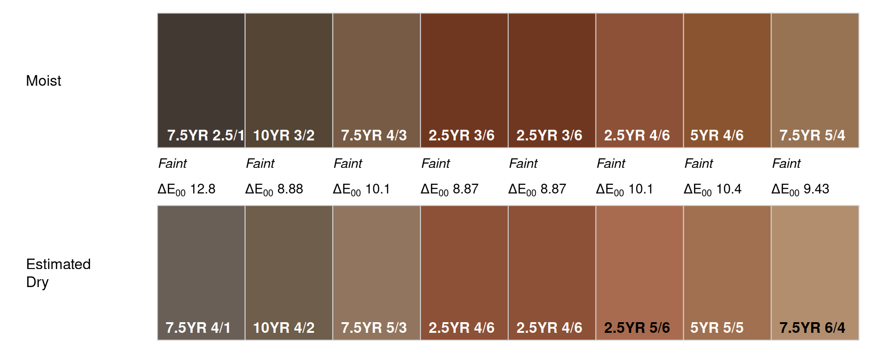
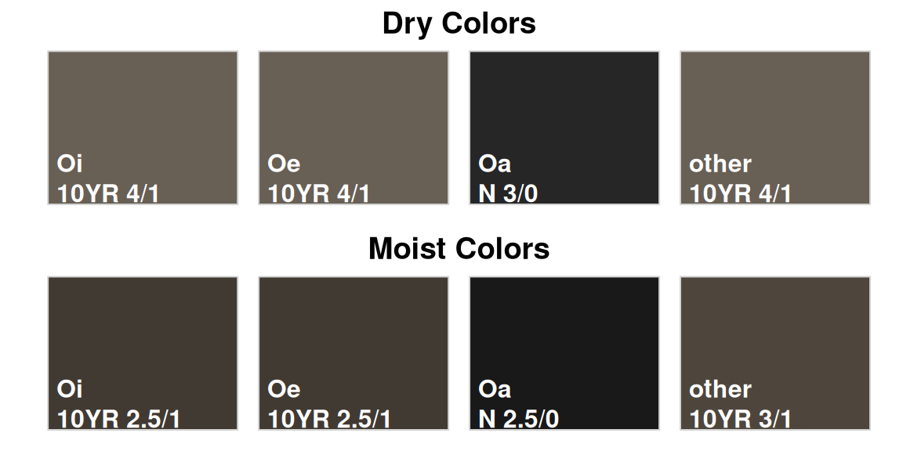

# Munsell Color Conversion

The `aqp` package provides several functions for working with colors
specified in the [Munsell color
system](https://en.wikipedia.org/wiki/Munsell_color_system).

## Munsell Notation

[`formatMunsell()`](https://ncss-tech.github.io/aqp/reference/formatMunsell.md)
and
[`launderMunsell()`](https://ncss-tech.github.io/aqp/reference/launderMunsell.md)

## Color Conversion Functions

Conversion of Munsell notation to “something” that can be displayed
on-screen (sRGB color representation) is probably the most common color
transformation applied to soil morphology data. The
[`munsell2rgb()`](https://ncss-tech.github.io/aqp/reference/munsell2rgb.md)
function is convenient for this operation when Munsell notation has been
split into vectors of hue, value, and chroma. These could be columns in
a `data.frame` or separate vectors. The
[`parseMunsell()`](https://ncss-tech.github.io/aqp/reference/parseMunsell.md)
function is convenient when a full Munsell notation is given as a
character vector. Note that
[`parseMunsell()`](https://ncss-tech.github.io/aqp/reference/parseMunsell.md)
is a wrapper to
[`munsell2rgb()`](https://ncss-tech.github.io/aqp/reference/munsell2rgb.md).
For example, converting `10YR 4/6` with either function can return:

- hex-notation of a color: `#805921FF`, or
- [sRGB](https://en.wikipedia.org/wiki/SRGB) color coordinates:
  `0.5002233 0.3489249 0.1287694`, or
- [CIELAB](https://en.wikipedia.org/wiki/CIELAB_color_space) color
  coordinates: `40.95021 10.31088 37.49513`.

Selection of the closest `n` Munsell color “chips”, given sRGB or CIELAB
colorspace coordinates is performed with the
[`col2Munsell()`](https://ncss-tech.github.io/aqp/reference/col2Munsell.md)
function. Input to this function can be colorspace coordinates, named
colors (e.g. `red`), or hex-notation of a color. For example, the
selection of the closest Munsell chip for CIELAB coordinates
`(51.4337, 9.917916, 38.6889)` results in `10YR 5/6` with a reported
sigma (error) of `1.5e-6`. This error is estimated as the [CIE2000
distance](https://en.wikipedia.org/wiki/Color_difference#CIEDE2000)
between the source CIELAB coordinates and the CIELAB coordinates of the
closest Munsell chip.

A representative Munsell color can be estimated from reflectance spectra
in the range of 380nm to 730nm with the
[`spec2Munsell()`](https://ncss-tech.github.io/aqp/reference/spec2Munsell.md)
function.


### Special Cases

Neutral colors are commonly specified two ways in the Munsell system:
`N 3/` or `N 3/0`, either format will work with
[`munsell2rgb()`](https://ncss-tech.github.io/aqp/reference/munsell2rgb.md)
and
[`parseMunsell()`](https://ncss-tech.github.io/aqp/reference/parseMunsell.md).

Non-standard Munsell notation (e.g. `3.6YR 4.4 / 5.6`), possibly
collected with a sensor vs. color book, can be approximated with
[`getClosestMunsellChip()`](https://ncss-tech.github.io/aqp/reference/getClosestMunsellChip.md).
A more accurate conversion can be performed with the [`munsellinterpol`
package.](https://cran.r-project.org/package=munsellinterpol).

### Reflectance Spectra

[`spec2Munsell()`](https://ncss-tech.github.io/aqp/reference/spec2Munsell.md)

### Examples

``` r
# Munsell -> hex color
parseMunsell('5PB 4/6')
```

    #> [1] "#476189FF"

``` r
# Munsell -> sRGB
parseMunsell('5PB 4/6',  return_triplets = TRUE)
```

    #>           r         g         b
    #> 1 0.2774433 0.3816871 0.5373067

``` r
# Munsell -> CIELAB
parseMunsell('5PB 4/6',  returnLAB = TRUE)
```

    #>          L        A         B
    #> 1 40.78393 1.583845 -25.09816

``` r
# hex color -> Munsell
col2Munsell('#476189FF')
```

    #>   hue value chroma     sigma
    #> 1 5PB     4      6 0.2196242

``` r
# neutral color
parseMunsell('N 5/')
```

    #> [1] "#767676FF"

``` r
# non-standard notation
getClosestMunsellChip('3.3YR 4.4/6.1', convertColors = FALSE)
```

    #> [1] "2.5YR 4/6"

## Estimating Dry ↔︎ Moist Colors

All else equal, soil color will predictably shift in perceived lightness
(change in Munsell value) as moisture content changes. Field-described
soil colors are typically collected at approximately air dry (“dry”) and
field capacity (“moist”) states. This function estimates “dry” soil
colors from “moist” soil colors and vice versa. Two methods are
available for estimation, both developed from a national collection of
field-described soil colors (approx. 800k horizons). Estimates are only
valid for mineral soil material, having Munsell values and chroma \< 10.
Estimation has a median error rate of approximately (CIE dE2000) 5.

Available Methods: \* “procrustes”: soil colors are converted using
scale, rotation, and translation parameters in CIELAB color space \*
“ols”: soil colors are converted using 3 multiple linear regression
models (CIELAB coordinates)

The two methods will give similar results, with `ols` usually closer to
observed moist or dry colors. Estimating moist → dry color change is not
guaranteed symmetric with estimating dry → moist color.

In the example below, the estimated dry colors are the same for both
`method = 'procrustes'` and `method = 'ols'`.

``` r
# example moist soil colors from the Musick soil series
m <- c("7.5YR 2.5/1", "10YR 3/2", "7.5YR 4/3", "2.5YR 3/6", "2.5YR 3/6", 
       "2.5YR 4/6", "5YR 4/6", "7.5YR 5/4")

mm <- parseMunsell(m, convertColors = FALSE)

d.p <- estimateSoilColor(
  hue = mm$hue, 
  value = mm$value, 
  chroma = mm$chroma, 
  method = 'procrustes', 
  sourceMoistureState = 'moist'
)

d.ols <- estimateSoilColor(
  hue = mm$hue, 
  value = mm$value, 
  chroma = mm$chroma, 
  method = 'ols', 
  sourceMoistureState = 'moist'
)

d.p <- formatMunsell(d.p$hue, d.p$value, d.p$chroma)
d.ols <- formatMunsell(d.ols$hue, d.ols$value, d.ols$chroma)

colorContrastPlot(m, d.p, labels = c('Moist', 'Estimated\nDry'), d.cex = 0.9)
```



``` r
# it is the same
# colorContrastPlot(m, d.ols, labels = c('Moist', 'Estimated\nDry'), d.cex = 0.9)
```

### Organic Soil Colors

Representative O horizon colors for the most common types of organic
soil material, at dry and moist states, have been added to aqp
(\>=2.3.1) as `Ohz.colors`. Colors were derived from an analysis of soil
morphologic data (5245 horizons) within the USDA-NRCS National Soil
Information System. Representative colors are the L1 median colors (see
[`colorVariation()`](https://ncss-tech.github.io/aqp/reference/colorVariation.md))
within groups generalized to “Oi”, “Oe”, “Oa”, and all “other”. These
estimates may be useful place-holder values for soil color in
collections where O horizon color was not recorded.

``` r
data("Ohz.colors")

Ohz.colors$col <- parseMunsell(Ohz.colors$L1.munsell)

op <- par(mfrow = c(2, 1), mar = c(0.5, 0.5, 1.5, 0))

with(
  Ohz.colors[Ohz.colors$state == 'dry', ],
  soilPalette(colors = col, lab = sprintf("%s\n%s", genhz, L1.munsell), lab.cex = 1)
)
title(main = 'Dry Colors')

with(
  Ohz.colors[Ohz.colors$state == 'moist', ],
  soilPalette(colors = col, lab = sprintf("%s\n%s", genhz, L1.munsell), lab.cex = 1)
)
title(main = 'Moist Colors')
```



``` r
# restore original base graphics state
par(op)
```
