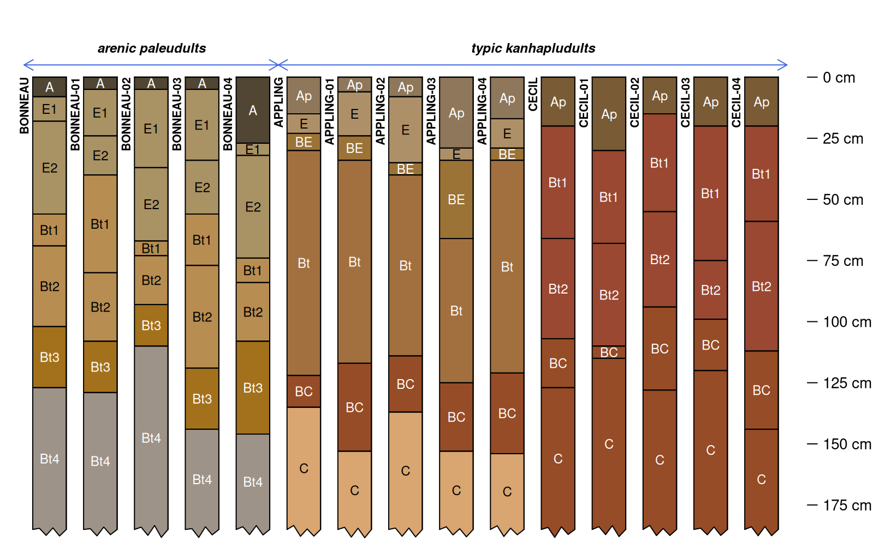

# Numerical Classification of Soil Profiles

## Introduction

With the release of {aqp} 2.0, the soil profile comparison algorithm
implemented in `profile_compare()` (Beaudette et al., 2013) has been
completely re-written as
[`NCSP()`](https://ncss-tech.github.io/aqp/reference/NCSP.md) and
re-named the “Numerical Comparison of Soil Profiles”. A more recent
discussion of this algorithm is provided in Maynard et al. (2020).

This short vignette demonstrates how to use the
[`NCSP()`](https://ncss-tech.github.io/aqp/reference/NCSP.md) function
from {aqp} 2.x to perform a pair-wise comparison of soil data encoded as
a `SoilProfileCollection` object. The pair-wise comparison of site-level
attributes, previously available in `profile_compare()` has been removed
from [`NCSP()`](https://ncss-tech.github.io/aqp/reference/NCSP.md) and
implemented as a stand-alone function named
[`compareSites()`](https://ncss-tech.github.io/aqp/reference/compareSites.md).
A final distance matrix (combining horizon and site level attributes) is
created via weighted average. A more detailed version of this vignette
can be found in the [Pair-Wise Distances by Generalized Horizon
Labels](https://ncss-tech.github.io/AQP/aqp/genhz-distance-eval.html)
tutorial.

## A Simple Example

Consider three soil profiles, containing basic morphology associated
with the
[Appling](https://casoilresource.lawr.ucdavis.edu/sde/?series=appling),
[Bonneau](https://casoilresource.lawr.ucdavis.edu/sde/?series=Bonneau),
and [Cecil](https://casoilresource.lawr.ucdavis.edu/sde/?series=cecil)
soil series. These data are provided in the example data set “osd” as
part of the {aqp} package.

``` r
library(aqp)
library(cluster)

# load data and make a copy
data("osd")
x <- osd
```

Simulation is used below to generate 4 realizations of each soil series,
using the
[`perturb()`](https://ncss-tech.github.io/aqp/reference/perturb.md)
function.

``` r
# assume a standard deviation of 10cm for horizon boundary depths
# far too large for most horizons, but helps to make a point
x$hzd <- 10

# generate 4 realizations of each soil profile in `x`
# limit the minimum horizon thickness to 5cm
set.seed(10101)
s <- perturb(x, id = sprintf("sim-%02d", 1:4), boundary.attr = 'hzd', min.thickness = 5)

# combine source + simulated data into a single SoilProfileCollection
z <- combine(x, s)
```

A quick review of the source and simulated profiles, note patterns in
horizon depths, horizon designation, and moist soil colors. The profiles
have been visually truncated at 185cm for clarity (note ragged bottoms).
The new `.aqp.plotSPC.args` option is used to set default arguments to
[`plotSPC()`](https://ncss-tech.github.io/aqp/reference/SoilProfileCollection-plotting-methods.md)
for the remainder of the R session. Simulated profiles are labeled with
a numeric suffix (e.g. “-01”)

``` r
# set plotSPC argument defaults
options(.aqp.plotSPC.args = list(name.style = 'center-center', depth.axis = list(style = 'compact', line = -2.5), width = 0.33, cex.names = 0.75, cex.id = 0.66, max.depth = 185))

par(mar = c(0, 0, 0, 1))
plotSPC(z)
```


Subgroup level classification (encoded as an un-ordered factor) will be
used as a site-level attribute for computing pair-wise distances.
Quickly review the grouping structure with
[`groupedProfilePlot()`](https://ncss-tech.github.io/aqp/reference/groupedProfilePlot.md).

``` r
# encode as a factor for distance calculation
z$subgroup <- factor(z$subgroup)

par(mar = c(0, 0, 1, 1))
groupedProfilePlot(z, groups = 'subgroup', group.name.offset = -10, break.style = 'arrow', group.line.lty = 1, group.line.lwd = 1)
```



Horizon designation, grouped into [“generalized horizon
labels”](https://ncss-tech.github.io/AQP/aqp/gen-hz-assignment.html)
will be used as the horizon-level attribute for computing pair-wise
distances. REGEX pattern matching is used to apply generalized horizon
labels (GHL) to each horizon, and are encoded as ordered factors. A
thematic soil profile sketch (horizon color defined by a property or
condition) is a convenient way to graphically check GHL assignment.

``` r
# assign GHL
z$genhz <- generalize.hz(
  z$hzname, new = c('A', 'E', 'Bt', 'C'), 
  pattern = c('A', 'E', 'Bt', 'C|Bt4')
)

# check GHL
par(mar = c(0, 0, 3, 1))
groupedProfilePlot(z, groups = 'subgroup', group.name.offset = -10, break.style = 'arrow', group.line.lty = 1, group.line.lwd = 1, color = 'genhz')
```


Define weights and compute separately horizon and site level distance
matrices. In this case, the site-level distances are give double the
weight as the horizon-level distances. See the manual pages
([`?NCSP`](https://ncss-tech.github.io/aqp/reference/NCSP.md) and
[`?compareSites`](https://ncss-tech.github.io/aqp/reference/compareSites.md))
for additional arguments that can be used to further customize the
comparison.

``` r
# horizon-level distance matrix weight
w1 <- 1
# perform NCSP using only the GHL (ordered factors) to a depth of 185cm
d1 <- NCSP(z, vars = c('genhz'), maxDepth = 185, k = 0, rescaleResult = TRUE)

# site-level distance matrix weight
w2 <- 2
# Gower's distance metric applied to subgroup classification (nominal factor)
d2 <- compareSites(z, 'subgroup')

# perform weighted average of distance matrices
D <- Reduce(
  `+`, 
  list(d1 * w1, d2 * w2)
) / sum(c(w1, w2))
```

Investigate the final distance matrix using divisive hierarchical
clustering. The
[`plotProfileDendrogram()`](https://ncss-tech.github.io/aqp/reference/plotProfileDendrogram.md)
function is a convenient way to combine the resulting dendrogram with
soil profile sketches. Note that the site-level distances have a very
strong effect on the overall clustering structure.

``` r
library(ape)

# divisive hierarchical clustering
h <- as.hclust(diana(D))

# hang soil profile sketches from resulting dendrogram
par(mar = c(1, 0, 0, 1))
plotProfileDendrogram(z, clust = h, scaling.factor = 0.0075, y.offset = 0.1, width = 0.33, color = 'genhz', name = NA)

# annotate dendrogram with subgroup classification
# this handy function provided by the ape package
tiplabels(pch = 15, col = c(2, 3)[z$subgroup], cex = 1.5, offset = 0.05)

# helpful legend
legend('topleft', legend = levels(z$subgroup), pch = 15, col = c(2, 3), bty = 'n')
```


## References

- Beaudette, D.E., P. Roudier, and A.T. O’Geen. 2013. Algorithms for
  quantitative pedology: A toolkit for soil scientists. Computers and
  Geoscience 52:258-268.
- Maynard, J.J., S.W. Salley, D.E. Beaudette, and J.E. Herrick. 2020.
  Numerical soil classification supports soil identification by citizen
  scientists using limited, simple soil observations. Soil Science
  Society of America Journal 84:1675-1692.
