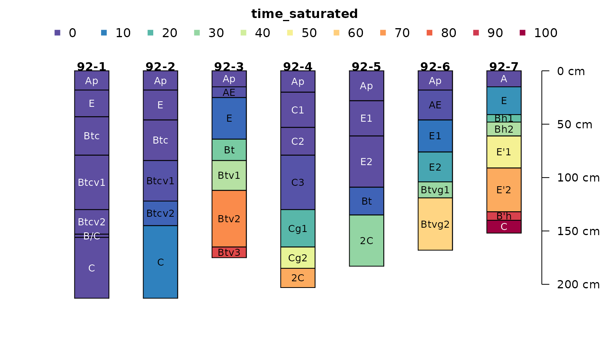
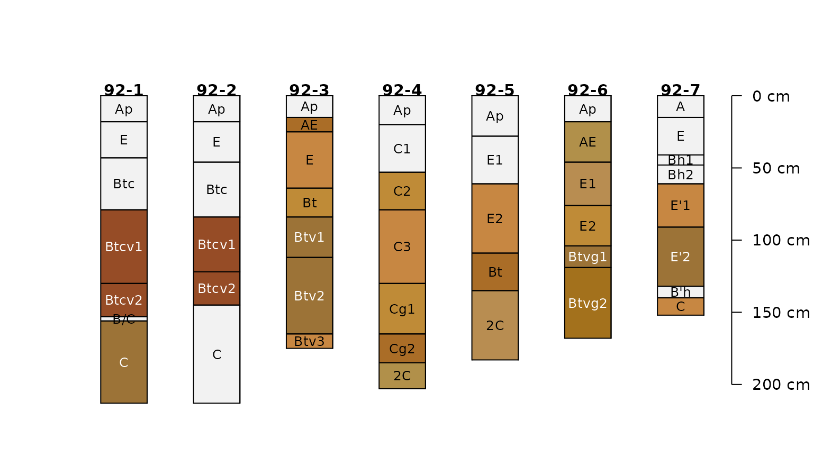
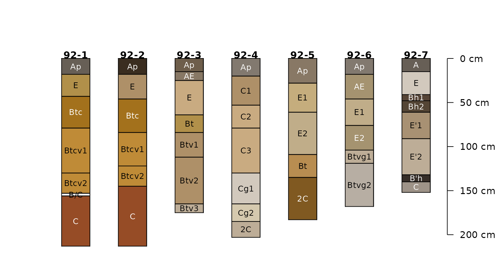
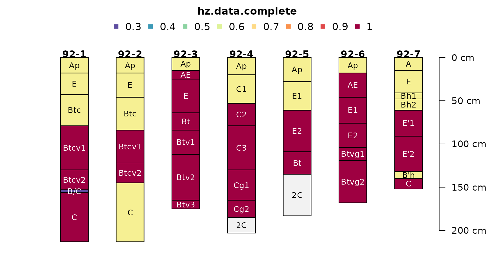
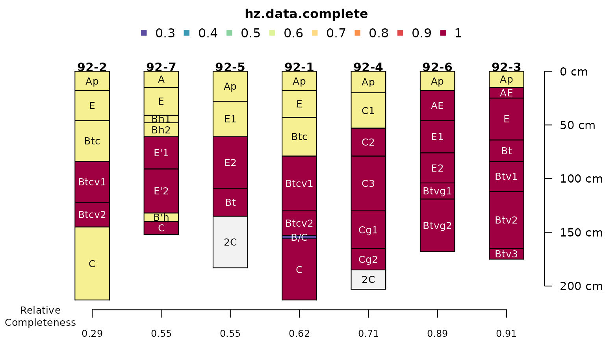

# Missing Data

``` r
library(aqp)
```

    ## This is aqp 2.2-1

``` r
# tighter margins
op <- par(mar = c(2, 2.5, 3, 2))

# example data
data("jacobs2000")

# fully populated
plotSPC(jacobs2000, name.style = 'center-center', 
        cex.names = 0.8, color = 'time_saturated')
```



``` r
# missing some data
plotSPC(jacobs2000, name.style = 'center-center', 
        cex.names = 0.8, color = 'concentration_color')
```



``` r
# very nearly complete
plotSPC(jacobs2000, name.style = 'center-center', 
        cex.names = 0.8, color = 'matrix_color')
```



``` r
# variables to consider
v <- c('time_saturated', 'concentration_color', 'matrix_color')

# compute data completeness by profile
# ignore 2C horizons
jacobs2000$data.complete <- evalMissingData(
  jacobs2000, 
  vars = v, 
  method = 'relative',
  p = '2C'
)

jacobs2000$data.complete.abs <- evalMissingData(
  jacobs2000, 
  vars = v, 
  method = 'absolute',
  p = '2C'
)

# compute data completeness by horizon
# ignore 2C horizons
jacobs2000$hz.data.complete <- evalMissingData(
  jacobs2000, 
  vars = v, 
  method = 'horizon',
  p = '2C'
)


# "fraction complete" by horizon
plotSPC(
  jacobs2000, name.style = 'center-center', 
  cex.names = 0.8, color = 'hz.data.complete'
)
```



``` r
# rank on profile completeness
new.order <- order(jacobs2000$data.complete)

# plot along data completeness ranking
plotSPC(
  jacobs2000, name.style = 'center-center', 
  cex.names = 0.8, color = 'hz.data.complete', 
  plot.order = new.order
)

# add relative completeness axis
# note re-ordering of axis labels
axis(
  side = 1, at = 1:length(jacobs2000), 
  labels = round(jacobs2000$data.complete[new.order], 2),
  line = 0, cex.axis = 0.75
)

# add absolute completeness (cm)
axis(
  side = 1, at = 1:length(jacobs2000), 
  labels = jacobs2000$data.complete.abs[new.order],
  line = 2.5, cex.axis=0.75
)

# label axes
mtext('Relative\nCompleteness', side = 1, at = 0.25, line = 0.25, cex = 0.8)
mtext('Absolute\nCompleteness (cm)', side = 1, at = 0.25, line = 2.75, cex = 0.8)
```



``` r
library(soilDB)

x <- fetchKSSL(series = 'pierre')

par(mar = c(0, 0, 3, 2))

plotSPC(x, color = 'clay', width = 0.3, name.style = 'center-center', label = 'pedon_completeness_index')
plotSPC(x, color = 'cec7', width = 0.3, name.style = 'center-center', label = 'pedon_completeness_index')
plotSPC(x, color = 'estimated_oc', width = 0.3, name.style = 'center-center', label = 'pedon_completeness_index')
plotSPC(x, color = 'ph_h2o', width = 0.3, name.style = 'center-center', label = 'pedon_completeness_index')
plotSPC(x, color = 'db_13b', width = 0.3, name.style = 'center-center', label = 'pedon_completeness_index')

# use a single variable
v <- c('ph_h2o')

par(mar = c(1, 0, 3, 2), xpd = NA)

x$pi <- profileInformationIndex(x, vars = v)
o <- order(x$pi)

plotSPC(x, color = 'ph_h2o', width = 0.33, name.style = 'center-center', label = 'pedon_completeness_index', plot.order = o)

.b <- x[, , .LAST, .BOTTOM]
text(x = 1:length(x), y = .b[o], labels = x$pi[o], cex = 0.75, pos = 1)
mtext('Profile Information Index (bytes)', side = 1, line = -0.5)

x$rel.not.missing <- evalMissingData(x, vars = v, method = 'relative')
x$abs.not.missing <- evalMissingData(x, vars = v, method = 'absolute')
x$hz.not.missing <- evalMissingData(x, vars = v, method = 'horizon')

o <- order(x$rel.not.missing)
plotSPC(x, color = 'hz.not.missing', width = 0.33, name.style = 'center-center', label = 'pedon_completeness_index', plot.order = o, col.label = 'Non-Missing Fraction within Horizons')
text(x = 1:length(x), y = .b[o], labels = round(x$rel.not.missing[o], 2), cex = 0.85, pos = 1)
mtext('Relative Non-Missing Fraction', side = 1, line = -0.5)

o <- order(x$abs.not.missing)
plotSPC(x, color = 'hz.not.missing', width = 0.33, name.style = 'center-center', label = 'pedon_completeness_index', plot.order = o, col.label = 'Non-Missing Fraction within Horizons')
text(x = 1:length(x), y = .b[o], labels = x$abs.not.missing[o], cex = 0.85, pos = 1)
mtext('Absolute Non-Missing (cm)', side = 1, line = -0.5)
```
