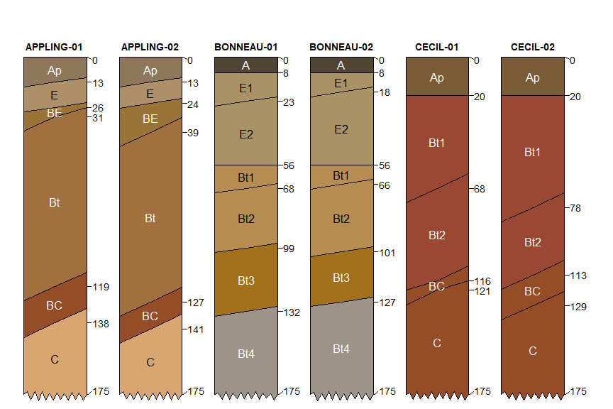

# Algorithms for Quantitative Pedology (aqp) package for R

[")](https://raw.githubusercontent.com/ncss-tech/aqp/master/misc/hexstickers/aqp_sticker_v2.png)

The Algorithms for Quantitative Pedology (AQP) project was started in
2009 to organize a loosely-related set of concepts and source code on
the topic of soil profile visualization, aggregation, and classification
into this package (aqp). Over the past 8 years, the project has grown
into a suite of related R packages that enhance and simplify the
quantitative analysis of soil profile data. Central to the AQP project
is a new vocabulary of specialized functions and data structures that
can accommodate the inherent complexity of soil profile information;
freeing the scientist to focus on ideas rather than boilerplate data
processing tasks <doi:10.1016/j.cageo.2012.10.020>. These functions and
data structures have been extensively tested and documented, applied to
projects involving hundreds of thousands of soil profiles, and deeply
integrated into widely used tools such as SoilWeb
<https://casoilresource.lawr.ucdavis.edu/soilweb-apps>. Components of
the AQP project (aqp, soilDB, sharpshootR, soilReports packages) serve
an important role in routine data analysis within the USDA-NRCS Soil
Science Division. The AQP suite of R packages offer a convenient
platform for bridging the gap between pedometric theory and practice.

## Installation

Get the stable version from CRAN:

``` r
install.packages('aqp', dep=TRUE)
```

Get the development version from Github, after installing the CRAN
version + dependencies:

``` r
remotes::install_github("ncss-tech/aqp", dependencies=FALSE, upgrade=FALSE, build=FALSE)
```

Install suggested packages:

``` r
p <- c("colorspace", "ape", "soilDB", "latticeExtra", "tactile", "compositions", 
"sharpshootR", "markovchain", "xtable", "testthat", "Gmedian", 
"farver", "Hmisc", "tibble", "RColorBrewer", "scales", "digest", 
 "mpspline2", "soiltexture", "knitr", "rmarkdown", "mvtnorm")

install.packages(p)
```

## Website

<http://ncss-tech.github.io/AQP/>

## Examples

``` r
library(aqp)

# example data from three official series descriptions
data("osd")

# simulate 2 copies of each
# using horizon boundary distinctness offsets
set.seed(10101)
x <- perturb(osd, n = 2, boundary.attr = 'hzd', min.thickness = 5)

# tighter margins
par(mar = c(0, 0, 1, 0))

# adjust default style
# depict truncation at 175cm with ragged bottom
plotSPC(
  x, 
  name.style = 'center-center', 
  cex.names = 1,
  width = 0.33,
  cex.id = 0.9,
  hz.distinctness.offset = 'hzd', 
  max.depth = 175, 
  depth.axis = FALSE, 
  hz.depths = TRUE
)
```



## Citation

``` r
citation("aqp")
#> To cite aqp in publications use:
#> 
#>   Beaudette, D., Roudier, P., Brown, A. (2023). aqp: Algorithms for
#>   Quantitative Pedology. R package version 2.0.
#>   <https://CRAN.R-project.org/package=aqp>
#> 
#>   Beaudette, D.E., Roudier, P., O'Geen, A.T. Algorithms for
#>   quantitative pedology: A toolkit for soil scientists, Computers &
#>   Geosciences, Volume 52, March 2013, Pages 258-268, ISSN 0098-3004,
#>   http://dx.doi.org/10.1016/j.cageo.2012.10.020.
#> 
#> To see these entries in BibTeX format, use 'print(<citation>,
#> bibtex=TRUE)', 'toBibtex(.)', or set
#> 'options(citation.bibtex.max=999)'.
```

## Related Papers and Book Chapters

- Beaudette D.E., P. Roudier, and J. Skovlin. 2016. Probabilistic
  representation of genetic soil horizons. In Book Digital soil
  morphometrics. Springer.
- Maynard, J.J., S.W. Salley, D.E. Beaudette, and J.E. Herrick. 2020.
  Numerical soil classification supports soil identification by citizen
  scientists using limited, simple soil observations. Soil Science
  Society of America Journal 84:1675-1692.
- Beaudette, D. E., J. Skovlin, A. G. Brown, P. Roudier, and S. M.
  Roecker. “Algorithms for Quantitative Pedology.” In Geopedology,
  edited by Joseph Alfred Zinck, Graciela Metternicht, Héctor Francisco
  del Valle, and Marcos Angelini, 201–22. Cham: Springer International
  Publishing, 2023. <https://doi.org/10.1007/978-3-031-20667-2_11>.

## Related Packages

- [soilDB](https://github.com/ncss-tech/soilDB)
- [sharpshootR](https://github.com/ncss-tech/sharpshootR)

## Vignettes

- [Introduction to SoilProfileCollection
  Objects](https://ncss-tech.github.io/aqp/articles/Introduction-to-SoilProfileCollection-Objects.html)
- [Numerical Classification of Soil
  Profiles](https://ncss-tech.github.io/aqp/articles/NCSP.html)
- [Overlapping
  Annotation](https://ncss-tech.github.io/aqp/articles/label-placement.html)
- [What is new in aqp
  2.x?](https://ncss-tech.github.io/aqp/articles/new-in-aqp-2.html)

## Tutorials

- [Soil Profile
  Sketches](https://ncss-tech.github.io/AQP/aqp/sketches.html)
- [Assigning Generalized Horizon
  Labels](https://ncss-tech.github.io/AQP/aqp/gen-hz-assignment.html)
- [Visualization of Horizon
  Boundaries](https://ncss-tech.github.io/AQP/aqp/hz-boundaries.html)
- [Mixing Munsell Colors in
  {aqp}](https://ncss-tech.github.io/AQP/aqp/mix-colors.html)
- [Theoretical Water Retention
  Curves](https://ncss-tech.github.io/AQP/aqp/water-retention-curves.html)
- [Soil Texture Visualization
  Ideas](https://ncss-tech.github.io/AQP/aqp/soiltexture-vizualization-ideas.html)

## Related Presentations / Posters

- [Numerical Classification of Soil Profiles (2023 NCSS
  Meetings)](https://ncss-tech.github.io/AQP/presentations/2023-NCSS-NCSP-poster.pdf)

## aqp in the Wild

- <https://www.pnas.org/content/115/26/6751>
- [as found by
  Scopus](https://www.scopus.com/results/citedbyresults.uri?sort=plf-f&cite=2-s2.0-84871520076&src=s&imp=t&sid=77a47f45322dcfd492772ab2198cbd60&sot=cite&sdt=a&sl=0&origin=inward&editSaveSearch=&txGid=2178c12c5b47dbcdd8b2f12cd9a81478)
- [as found by Google
  Scholar](https://scholar.google.com/scholar?cites=14155970656017510549&as_sdt=5,29&sciodt=0,29&hl=en)
- <http://www.scielo.br/scielo.php?script=sci_arttext&pid=S2179-80872019000100121>
